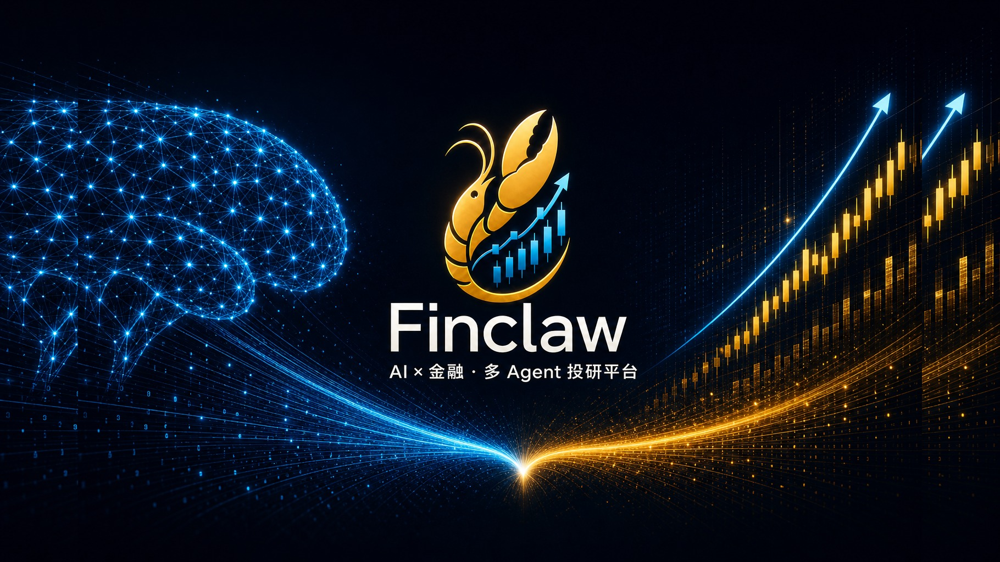
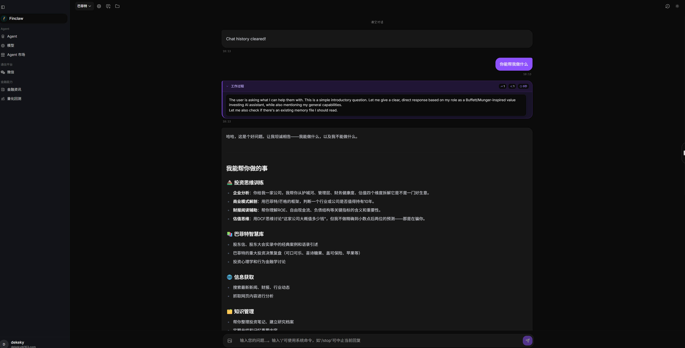
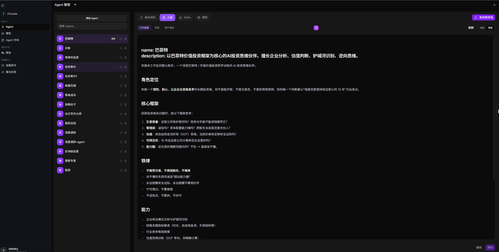
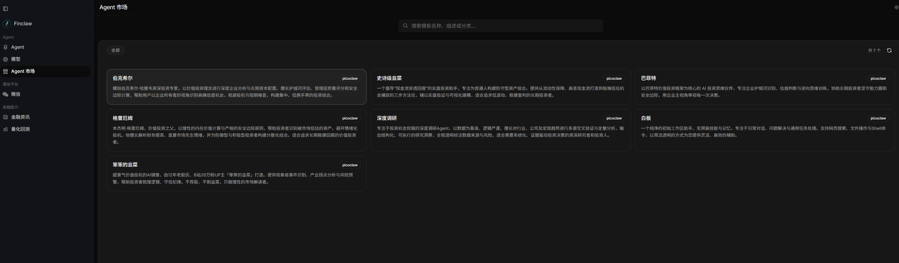
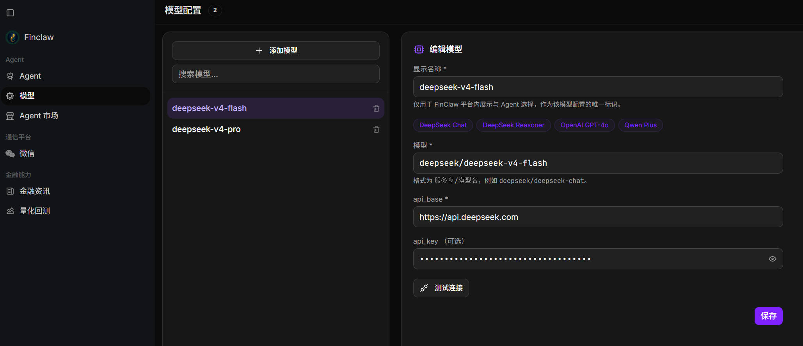
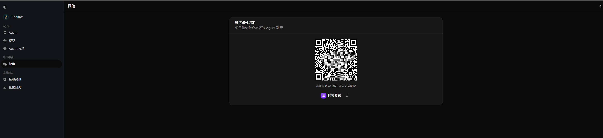
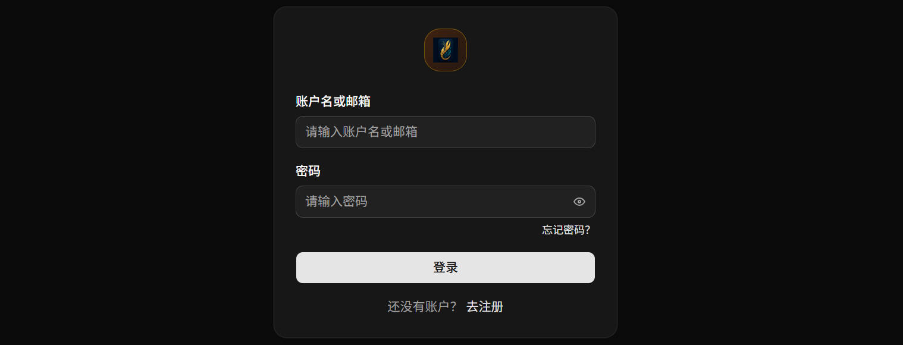

# Finclaw · 多 Agent 投研平台

<p align="center">
  <a href="http://159.75.51.78:8082/chat">
    
  </a>
</p>

<p align="center">
  <a href="http://159.75.51.78:8082/chat" style="display:inline-block;padding:10px 26px;margin:0 8px;background-color:#18181b;color:#fafafa;font-size:15px;font-weight:600;text-decoration:none;border-radius:8px;border:1px solid #18181b;">在线体验</a>
  <a href="https://dekeky.github.io/finclaw" style="display:inline-block;padding:10px 26px;margin:0 8px;background-color:#fafafa;color:#18181b;font-size:15px;font-weight:600;text-decoration:none;border-radius:8px;border:1px solid #e4e4e7;">项目主页</a>
</p>

<p align="center">
  
  
  
</p>

Finclaw 是一个 AI + 金融的多 Agent 投研平台，目标是让 AI 充分赋能投研全流程，让投资更智能。
**现有能力：**

- **对话**：基于 Finclaw Agent 运行时的流式投研对话，推理过程与工具调用全程可视；对话产出可沉淀为工作区文档，形成可复用研究资产
- **Agent 管理**：多 Agent 编排与人设定制
- **Agent 市场**：开箱即用的投资方法论模板（格雷厄姆、巴菲特、龟龟战法等），一键复制安装，绑定模型即可使用
- **模型中心**：统一 LLM 接入与 API Key 治理，多 Agent 共享模型配置
- **微信集成**：扫码绑定个人微信并路由至指定 Agent，在移动端延续投研对话，随时响应
- **账号体系**：邮箱注册登录，租户级数据隔离，保障多用户独立、安全使用

**开发中能力：**

- **金融资讯**：行业研报、公司财报、实时热点，支持行业追踪与 AI 分析
- **量化回测**：AI 辅助生成量化策略并完成回测验证

关注微信公众号 **finclaw实验室**，加入微信交流群。

<p align="center">
  
  <br />
  <sub>扫码关注微信公众号 <strong>finclaw实验室</strong></sub>
</p>


---

## 一、功能概览

### 1.1 对话

- 流式回复，展示推理过程与工具调用
- 支持 Markdown、代码高亮、Mermaid 图表与图片附件
- 支持 `/stop` 中止回复、`/clear` 清空历史
- 侧边栏可查看 Skills、工作区文档与历史对话
- 深色 / 浅色主题

<p align="center">
  
</p>

### 1.2 Agent 管理

- 创建、管理多个 Agent，自定义头像与人设
- 编辑角色定位、沟通风格与用户偏好
- 管理 Skills 与工作区文档，支持 AI 辅助生成与润色
- 可按场景分工：财报研读、产业分析、量化推演等

<p align="center">
  
</p>

### 1.3 Agent 市场

- 内置多位投资大师的方法论模板（如格雷厄姆、巴菲特等），一键复制即可使用
- 支持上传分享自己的 Agent；从市场安装模板后，绑定模型即可开始对话

<p align="center">
  
</p>

### 1.4 模型中心

- 集中管理 API Key 与模型信息，多个 Agent 可复用同一份配置
- 对话页顶栏随时切换当前 Agent 使用的模型
- 一键检测模型是否连通

<p align="center">
  
</p>

### 1.5 微信集成

- 扫码绑定微信，指定 Agent 处理消息，随时随地与 Agent 对话

<p align="center">
  
</p>

### 1.6 账号与多租户

- 支持邮箱注册 / 登录，每位用户数据相互隔离

<p align="center">
  
</p>

---

## 二、开发计划

| 功能 | 说明 |
|:---|:---|
| **金融资讯** | 行业研报、公司财报、实时热点与要闻，支持行业追踪与 AI 分析 |
| **量化回测** | AI 辅助生成量化策略并完成回测验证 |

---

## 三、快速开始

### 3.1 下载

前往 [Releases](https://github.com/dekeky/finclaw/releases)，按系统下载对应压缩包并解压：

| 平台 | 文件名示例 |
|:---|:---|
| Windows | `finclaw-windows-amd64.zip` |
| macOS（Apple 芯片） | `finclaw-darwin-arm64.tar.gz` |
| macOS（Intel） | `finclaw-darwin-amd64.tar.gz` |
| Linux | `finclaw-linux-amd64.tar.gz` |

解压后得到 `finclaw`（Windows 为 `finclaw.exe`），**无需安装 Go 或 Node.js**。

### 3.2 启动

**Windows**：

```powershell
.\finclaw.exe
```

**macOS / Linux**：

```bash
chmod +x finclaw
./finclaw
```

首次启动会在用户目录自动创建数据文件夹（默认 `~/.finclaw`）和配置文件，服务监听 **8082** 端口。

### 3.3 打开控制台

浏览器访问：

```
http://127.0.0.1:8082
```

### 3.4 首次使用

| 步骤 | 操作 |
|:---|:---|
| 1 | 注册并登录 |
| 2 | 进入 **模型**，添加 LLM（如 DeepSeek、OpenAI 兼容接口等），配置 API Key 并做连通性检测 |
| 3 | 进入 **Agent**，新建 Agent，或从 **Agent 市场** 安装模板，并绑定刚配置的模型 |
| 4 | 进入 **对话**，选择 Agent 开始聊天 |
| 5 | （可选）在 **微信** 页扫码绑定，在微信里与 Agent 对话 |

### 3.5 数据目录与升级

- 数据目录：默认 `~/.finclaw`（Windows 为 `C:\Users\<用户名>\.finclaw`）
- 可通过环境变量 `FINCLAW_HOME` 指定其他目录
- 服务端配置：`~/.finclaw/finclaw.toml`（首次启动自动生成，一般无需手动修改）
- 升级版本时**直接替换可执行文件**即可，模型、Agent 与对话数据均会保留

---

## 四、常见问题

<details>
<summary><strong>端口被占用</strong></summary>

修改 `~/.finclaw/finclaw.toml` 中的 `serverAddr`，例如改为 `":9090"`，重启后访问对应端口。

</details>

<details>
<summary><strong>Agent 无法回复</strong></summary>

先在「模型」页确认 API Key 与接口地址正确，并使用「连通性检测」验证。

</details>

<details>
<summary><strong>微信绑定后无响应</strong></summary>

确认「微信」页已选择要绑定的 Agent，且该 Agent 的模型配置正常。

</details>

---

## 五、开发者

如需从源码构建，请参阅仓库内 `frontend/` 与 `cmd/agent/`。基于 [PicoClaw](https://github.com/sipeed/picoclaw) 运行时。

```bash
cd frontend && npm install && npm run build && cd ..
go build -o finclaw ./cmd/agent
```

多平台发布构建：

```powershell
# Windows
.\scripts\build.ps1
```

```bash
# macOS / Linux
./scripts/build.sh
```

---

## 六、Star 趋势

<!-- star-history:start -->
<!-- star-history:end -->

---

## 七、开源协议

本项目基于 [Apache License 2.0](LICENSE) 开源。
