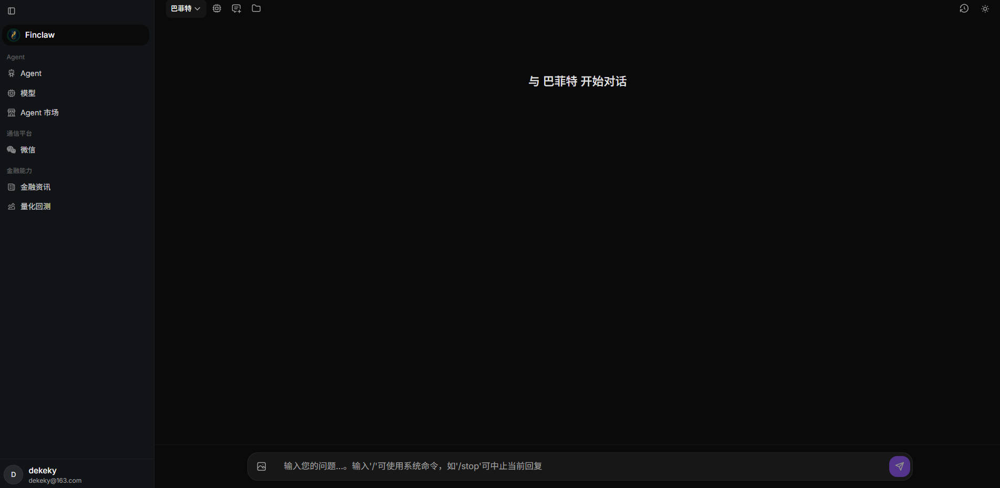

# Finclaw

面向金融与投研场景的多 Agent 平台。下载一个可执行文件即可本地运行，自带 Web 控制台；也支持接入微信，在手机上与你的 Agent 对话。

- **在线体验**：[http://159.75.51.78:8082/chat](http://159.75.51.78:8082/chat)
- **项目主页**：[dekeky.github.io/finclaw](https://dekeky.github.io/finclaw)
- **下载发布版**：[GitHub Releases](https://github.com/dekeky/finclaw/releases)

<p align="center">
  <a href="http://159.75.51.78:8082/chat">
    
  </a>
</p>

<p align="center">
  <a href="http://159.75.51.78:8082/chat"><strong>在线体验</strong></a>
  ·
  <a href="https://dekeky.github.io/finclaw"><strong>项目主页</strong></a>
</p>

## 现已支持

### 账号

- 邮箱注册 / 登录，每位用户数据相互隔离
- 可选邮箱验证码（管理员在配置文件中开启 SMTP 后生效）

### Agent

- 创建、管理多个 Agent，自定义头像与人设
- 编辑角色定位、沟通风格与用户偏好；管理 Skills 与工作区文档，支持 AI 辅助生成与润色
- **Agent 市场**已蒸馏多位投资大师的方法论，包括本杰明·格雷厄姆、沃伦·巴菲特等，一键安装即可拥有对应风格的投研助手；也可将自己的 Agent 上传分享
- 从市场安装模板后，绑定模型即可开始对话

### 模型

- **模型中心**集中管理 API Key 与模型信息，多个 Agent 可复用同一份配置
- 对话页顶栏随时切换当前 Agent 使用的模型
- 一键检测模型是否连通

### 对话

- 流式回复，展示推理过程与工具调用
- 支持 Markdown、代码高亮、Mermaid 图表与图片附件
- 支持 `/stop` 中止回复、`/clear` 清空历史
- 侧边栏可查看 Skills、工作区文档与历史对话
- 深色 / 浅色主题

### 微信

- 扫码绑定微信，指定 Agent 自动回复消息
- 运行中可切换绑定的 Agent，无需重启服务

## 即将上线

| 功能 | 说明 |
|------|------|
| 金融资讯 | 行业研报、公司财报、实时热点与要闻，支持行业追踪与 AI 分析 |
| 量化回测 | AI 辅助生成量化策略并完成回测验证 |

## 如何使用

### 1. 下载

前往 [Releases](https://github.com/dekeky/finclaw/releases)，按系统下载对应压缩包并解压：

| 平台 | 文件名示例 |
|------|------------|
| Windows | `finclaw-windows-amd64.zip` |
| macOS（Apple 芯片） | `finclaw-darwin-arm64.tar.gz` |
| macOS（Intel） | `finclaw-darwin-amd64.tar.gz` |
| Linux | `finclaw-linux-amd64.tar.gz` |

解压后得到 `finclaw`（Windows 为 `finclaw.exe`），**无需安装 Go 或 Node.js**。

### 2. 启动

**Windows**：

```powershell
.\finclaw.exe
```

**macOS / Linux**：

```bash
chmod +x finclaw
./finclaw
```

首次启动会在用户目录自动创建数据文件夹（默认 `~/.finclaw`）和配置文件，服务监听 **8082** 端口。

### 3. 打开控制台

浏览器访问：

```
http://127.0.0.1:8082
```

### 4. 建议上手流程

1. **注册并登录**
2. 进入 **模型**，添加你使用的 LLM（如 DeepSeek、OpenAI 兼容接口等），做一次连通性检测
3. 进入 **Agent**，新建 Agent，或从 **Agent 市场** 安装格雷厄姆、巴菲特等大师模板，并绑定刚配置的模型
4. 进入 **对话**，选择 Agent 开始聊天
5. （可选）在 **微信** 页扫码绑定，在微信里与你的 Agent 对话

### 5. 数据与升级

- 数据目录：默认 `~/.finclaw`（Windows 为 `C:\Users\<用户名>\.finclaw`）
- 可通过环境变量 `FINCLAW_HOME` 指定其他目录
- 服务端配置：`~/.finclaw/finclaw.toml`（首次启动自动生成，一般无需手动修改）
- 升级版本时**直接替换可执行文件**即可，模型、Agent 与对话数据均会保留

## 常见问题

**端口被占用**

修改 `~/.finclaw/finclaw.toml` 中的 `serverAddr`，例如改为 `":9090"`，重启后访问对应端口。

**Agent 无法回复**

先在「模型」页确认 API Key 与接口地址正确，并使用「连通性检测」验证。

**微信绑定后无响应**

确认「微信」页已选择要绑定的 Agent，且该 Agent 的模型配置正常。

## 开发者

如需从源码构建，请参阅仓库内 `frontend/` 与 `cmd/agent/`。基于 [PicoClaw](https://github.com/sipeed/picoclaw) 运行时。

```bash
cd frontend && npm install && npm run build && cd ..
go build -o finclaw ./cmd/agent
```

## Star 趋势

折线图由 [Star History](https://star-history.com) 根据 GitHub 上本仓库的 **Star 事件时间线**动态生成（每次 Star 记为一个数据点）。当前仓库 **2** 个 Star，折线会较短并贴近图表底部，属正常现象。

> 若曾设为私有仓库，GitHub 可能缓存了当时的空白图；下方已换用新版嵌入地址并带版本参数以刷新缓存。仍不显示时，可 [点此直接打开图表](https://api.star-history.com/chart?repos=dekeky/finclaw&type=date)。

<p align="center">
  <a href="https://star-history.com/#dekeky/finclaw&Date">
    <picture>
      <source media="(prefers-color-scheme: dark)" srcset="https://api.star-history.com/chart?repos=dekeky/finclaw&type=date&theme=dark&v=20260627" />
      <source media="(prefers-color-scheme: light)" srcset="https://api.star-history.com/chart?repos=dekeky/finclaw&type=date&v=20260627" />
      
    </picture>
  </a>
</p>

[](https://github.com/dekeky/finclaw/stargazers)

## 开源协议

本项目基于 [Apache License 2.0](LICENSE) 开源。
