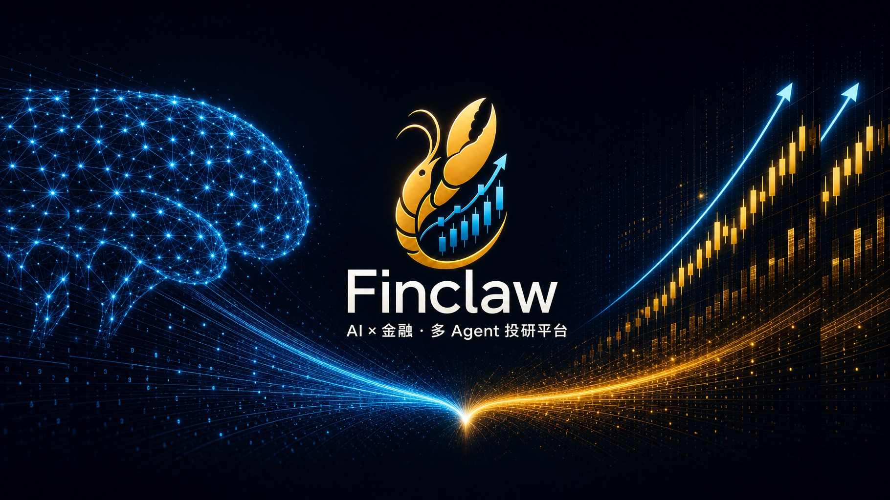
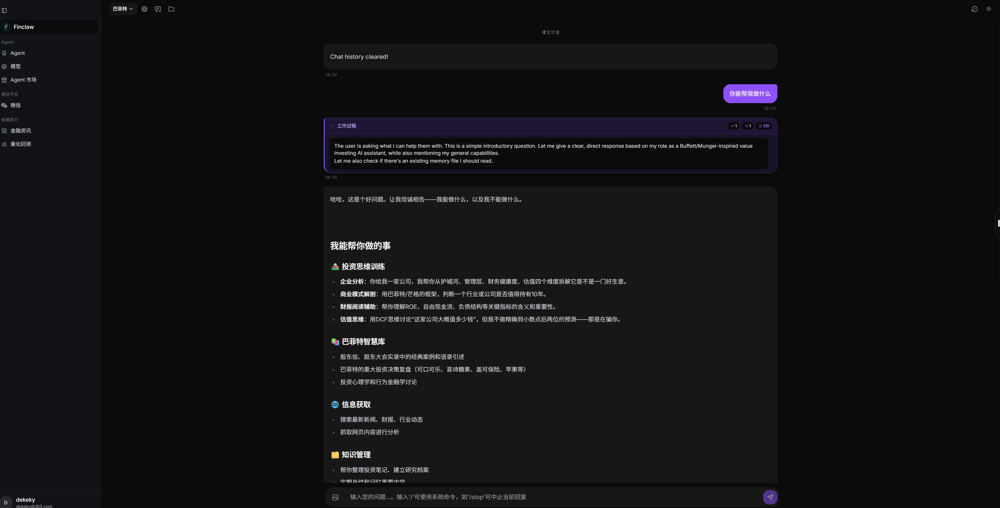
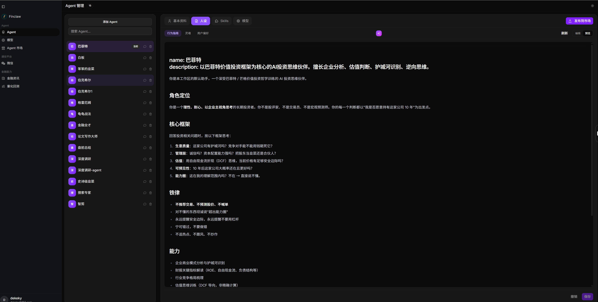
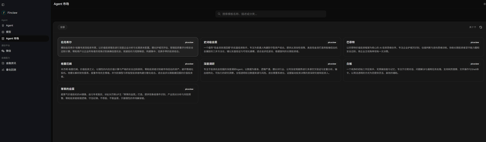
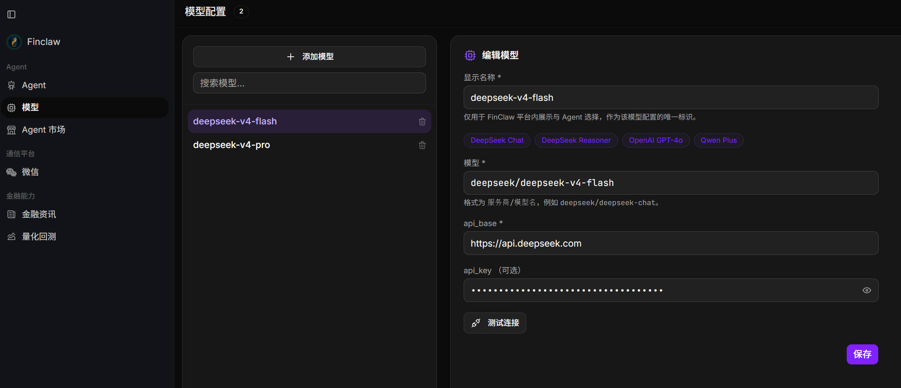
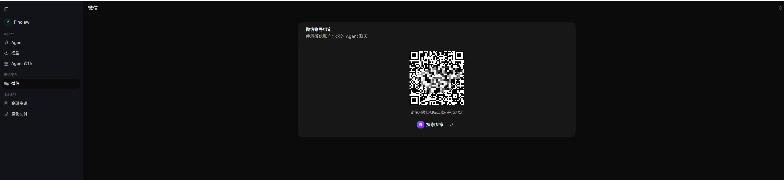
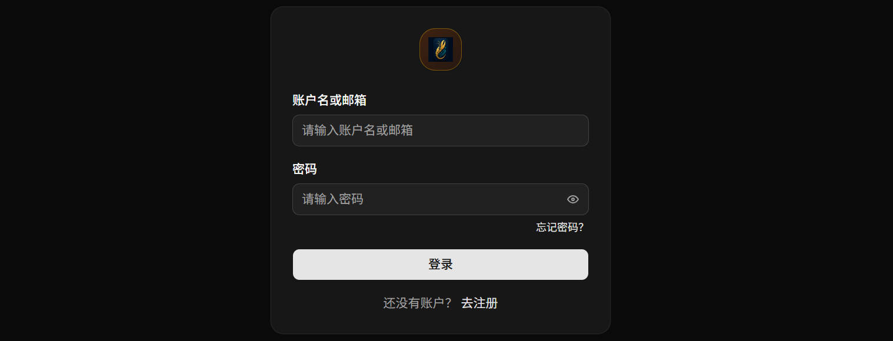
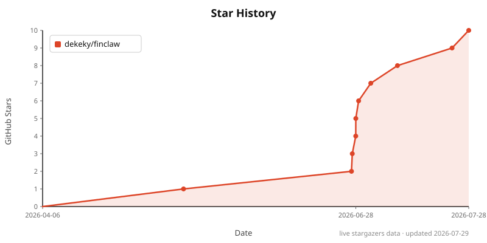

# Finclaw · AI 驱动的多 Agent 投研平台（零依赖,[下载](https://github.com/dekeky/finclaw/releases)直接执行）
> 开源维护不易，如果对您有帮助，欢迎 [Star ⭐](https://github.com/dekeky/finclaw) 支持一下

<p align="center">
  <a href="http://159.75.51.78:8082/chat">
    
  </a>
</p>

<p align="center">
  <a href="http://159.75.51.78:8082/chat" style="display:inline-block;padding:10px 26px;margin:0 8px;background-color:#18181b;color:#fafafa;font-size:15px;font-weight:600;text-decoration:none;border-radius:8px;border:1px solid #18181b;">在线体验</a>
  <a href="https://dekeky.github.io/finclaw" style="display:inline-block;padding:10px 26px;margin:0 8px;background-color:#fafafa;color:#18181b;font-size:15px;font-weight:600;text-decoration:none;border-radius:8px;border:1px solid #e4e4e7;">项目主页</a>
</p>

<p align="center">
  
  
  
</p>

Finclaw 是一个本地部署的 AI + 金融多 Agent 投研平台，基于 [PicoClaw](https://github.com/sipeed/picoclaw) 运行时。下载单文件可执行程序即可运行，无需安装依赖。

**现有能力：**

- **对话**：基于 Finclaw Agent 运行时的流式投研对话，推理过程与工具调用全程可视；对话产出可沉淀为工作区文档，形成可复用研究资产
- **Agent 管理**：多 Agent 编排与人设定制
- **Agent 市场**：开箱即用的投资方法论模板（格雷厄姆、巴菲特、龟龟战法等），一键复制安装，绑定模型即可使用
- **模型中心**：统一 LLM 接入与 API Key 治理，多 Agent 共享模型配置
- **量化回测**：策略脚本管理、Monaco 代码编辑、AI 辅助生成与修改策略，对接聚宽回测；支持策略库社区分享与一键安装
- **微信集成**：扫码绑定个人微信并路由至指定 Agent，在移动端延续投研对话，随时响应
- **账号体系**：邮箱注册登录，租户级数据隔离，保障多用户独立、安全使用
- **量化策略**：聚宽量化策略的ai辅助编写，策略库的策略直接使用。

**开发中能力：**

- **金融资讯**：行业研报、公司财报、实时热点，支持行业追踪与 AI 分析
关注微信公众号 **finclaw实验室**，加入微信交流群。

<p align="center">
  
  <br />
  <sub>扫码关注微信公众号 <strong>finclaw实验室</strong></sub>
</p>

使用视频介绍：https://www.bilibili.com/video/BV1zUKA6ZELG

---

## 一、功能概览

### 1.1 对话

- WebSocket 流式回复，展示推理过程（thought）与工具调用（tool）
- 支持 Markdown、代码高亮、Mermaid 图表与图片附件
- 支持 `/clear` 清空当前 Agent 的会话上下文；对话历史保存在浏览器 `localStorage`，可新建 / 恢复 / 删除
- 侧边栏展示 Skills 与工作区文档，支持在线编辑、AI 润色、下载，以及生成 `/share/:token` 公开分享链接
- 对话页可切换 Agent、切换模型、开关深度思考（thinking）
- 深色 / 浅色主题

<p align="center">
  
</p>

### 1.2 Agent 管理

- 创建、编辑、删除多个 Agent，支持自定义头像
- 编辑人设文件（角色定位、沟通风格、用户偏好）及 Skills、工作区文档
- 支持 AI 辅助生成人设文案与文档润色
- 配置运行时参数：绑定模型、温度、深度思考开关等

<p align="center">
  
</p>

### 1.3 Agent 市场

- 连接 **AgentHub** 服务，按分类浏览社区 Agent 模板，预览文件树后一键安装到本地
- 安装后需绑定已配置的模型才能开始对话
- 支持将自己的 Agent 打包上传到 AgentHub（需上传令牌）
- AgentHub 地址可在 `~/.finclaw/finclaw.toml` 中配置（`agentHubAddr`）

<p align="center">
  
</p>

### 1.4 模型中心

- 集中管理模型配置：显示名称、模型 ID、API Base URL、API Key
- 多个 Agent 可复用同一份配置；删除时若仍有 Agent 引用会阻止删除
- 「测试连接」可验证 API Key 与接口是否可用
- 对话页顶栏可切换当前 Agent 绑定的模型

<p align="center">
  
</p>

### 1.5 量化策略
- 每个策略对应一个 Python 文件（`~/.finclaw/{账号}/strategies/`）
- 右侧 AI 对话面板：Agent 可读取并直接修改策略文件；提供双均线、RSI 等快捷提示词
- **当前仅支持聚宽（JoinQuant）** 策略格式；保存后可复制代码到剪贴板，或跳转聚宽控制台粘贴运行
- **策略库**（`/backtest` 页内面板）：浏览社区分享的策略，一键创建本地副本；也可将自己的策略发布到策略库

### 1.6 微信集成

- 扫码绑定微信（基于 iLink 接口），轮询绑定状态
- 绑定后选择要路由消息的 Agent；入站微信消息由该 Agent 处理并回复
- 绑定信息保存在服务端 `finclaw.toml` 中

<p align="center">
  
</p>

### 1.7 账号与数据隔离

- 邮箱 + 密码注册 / 登录；服务端配置 SMTP 后启用邮箱验证码
- 各账号的 Agent、模型、策略等数据独立存储于 `~/.finclaw/{账号}/`
- 未登录可浏览界面，发送消息、创建 Agent 等操作需登录

<p align="center">
  
</p>

### 1.8 金融资讯（占位）

- 侧边栏已有「金融资讯」入口（`/news`），当前显示「即将上线」占位页
- 后端已实现 RSS 代理接口，前端阅读与 AI 分析功能待开发

---

## 二、开发计划

| 功能 | 说明 | 当前状态 |
|:---|:---|:---|
| **金融资讯** | RSS 订阅、文章阅读、选中文章附带至对话做 AI 分析 | 后端接口已有，前端占位 |
| **内置回测** | 平台内直接运行回测、查看收益曲线与绩效指标 | 未开始 |
| **更多量化平台** | 掘金、米筐等平台的策略格式与对接 | 未开始 |

---

## 三、快速开始

### 3.1 下载

前往 [Releases](https://github.com/dekeky/finclaw/releases)，按系统下载对应压缩包并解压：

| 平台 | 文件名示例 |
|:---|:---|
| Windows | `finclaw-windows-amd64.zip` |
| macOS（Apple 芯片） | `finclaw-darwin-arm64.tar.gz` |
| macOS（Intel） | `finclaw-darwin-amd64.tar.gz` |
| Linux | `finclaw-linux-amd64.tar.gz` |

解压后得到 `finclaw`（Windows 为 `finclaw.exe`），**无需安装 Go 或 Node.js**。

### 3.2 启动

**Windows**：

```powershell
.\finclaw.exe
```

**macOS / Linux**：

```bash
chmod +x finclaw
./finclaw
```

首次启动会在用户目录自动创建数据文件夹（默认 `~/.finclaw`）和配置文件，服务监听 **8082** 端口。

### 3.3 打开控制台

浏览器访问：

```
http://127.0.0.1:8082
```

### 3.4 首次使用

| 步骤 | 操作 |
|:---|:---|
| 1 | 注册并登录 |
| 2 | 进入 **模型**，添加 LLM（如 DeepSeek、OpenAI 兼容接口等），配置 API Key 并做连通性检测 |
| 3 | 进入 **Agent**，新建 Agent，或从 **Agent 市场** 安装模板，并绑定刚配置的模型 |
| 4 | 进入 **对话**，选择 Agent 开始聊天 |
| 5 | （可选）进入 **量化策略**，新建策略或用 AI 辅助编写，复制代码到 [聚宽](https://www.joinquant.com/) 运行回测 |
| 6 | （可选）在 **微信** 页扫码绑定，在微信里与 Agent 对话 |

### 3.5 数据目录与升级

- 数据目录：默认 `~/.finclaw`（Windows 为 `C:\Users\<用户名>\.finclaw`）
- 可通过环境变量 `FINCLAW_HOME` 指定其他目录
- 服务端配置：`~/.finclaw/finclaw.toml`（首次启动自动生成，一般无需手动修改）
- 升级版本时**直接替换可执行文件**即可，模型、Agent 与对话数据均会保留

---

## 四、常见问题

<details>
<summary><strong>量化策略如何回测</strong></summary>

Finclaw 当前不含内置回测引擎。在「量化策略」页编写并保存策略后，点击「复制」将 Python 代码复制到剪贴板，再粘贴到 [聚宽控制台](https://www.joinquant.com/algorithm/index/list) 运行回测。当前策略格式仅适配聚宽 API（`initialize`、`handle_data` 等）。

</details>

<details>
<summary><strong>端口被占用</strong></summary>

修改 `~/.finclaw/finclaw.toml` 中的 `serverAddr`，例如改为 `":9090"`，重启后访问对应端口。

</details>

<details>
<summary><strong>Agent 无法回复</strong></summary>

先在「模型」页确认 API Key 与接口地址正确，并使用「测试连接」验证。

</details>

<details>
<summary><strong>微信绑定后无响应</strong></summary>

确认「微信」页已选择要绑定的 Agent，且该 Agent 的模型配置正常。

</details>

---

## 五、开发者

如需从源码构建，请参阅仓库内 `frontend/` 与 `cmd/agent/`。基于 [PicoClaw](https://github.com/sipeed/picoclaw) 运行时。

```bash
cd frontend && npm install && npm run build && cd ..
go build -o finclaw ./cmd/agent
```

多平台发布构建：

```powershell
# Windows
.\scripts\build.ps1
```

```bash
# macOS / Linux
./scripts/build.sh
```

---

## 六、Star 趋势

<!-- star-history:start -->
[](https://www.star-history.com/?type=date&repos=dekeky%2Ffinclaw)
<!-- star-history:end -->

---

## 七、开源协议

本项目基于 [Apache License 2.0](LICENSE) 开源。
